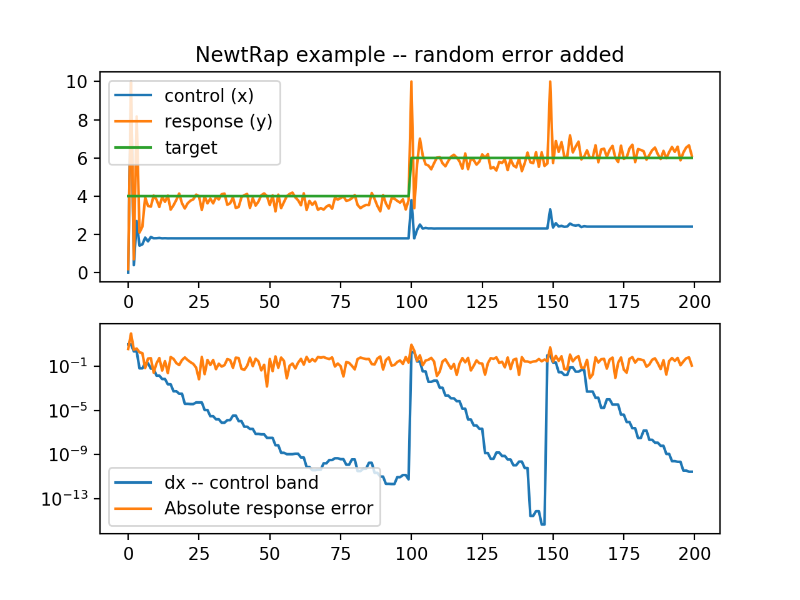
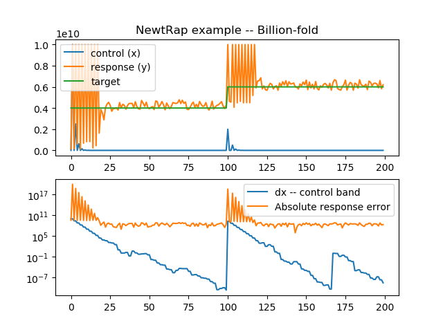
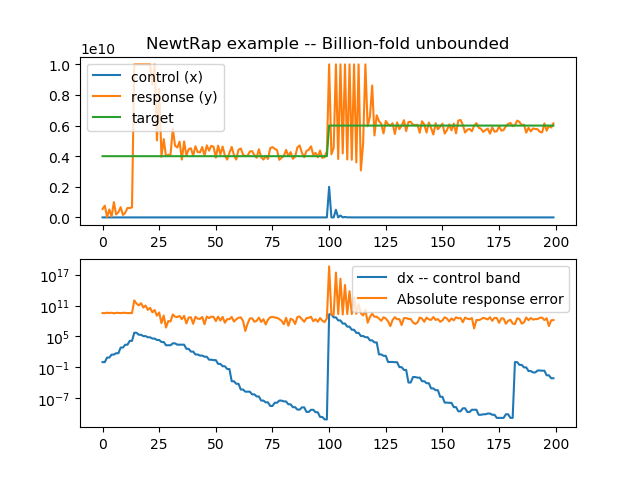

# NewtRap
## Newton-Raphson method process control
 The idea is to find the input 'x' that gives an output closest to target

 There is (optional) bounding limits on x: 'lo' and 'hi' 
 you can start with an (optional) initial guess 'x0'
 You can set the allowable error 'error' margin (2-sided)

 Needs no other modules
 (The test program uses matplotlib, random and numpy)

## Method:
 Newton-Raphson for finding a function zero:
 
 x1 = x0 - f(x0)/f'(x0)

 since we don't have a derivative, we need to points to get a difference
 We could choose 2 close points, but that would lead to instability with small output errors
 so we choose the midpoint

## Written by Paul H Alfille 2020

## Usage:
```python
import newtrap
 
 target = 10
 error = .2
 x0 = 1
 lo = 0
 hi = 2
 
 nr = newtrap.NewtRap( target, error=error, lo=lo, hi=hi, x0=x0 )

 x = x0
 
 while True:
    y = my_process(x)
    print(x,y)    
    x = nr.next(y)
```    
## Example from included test program


Here x is chasing a noisy x^2 target

## More detail
Lets' go the the test directory
### newtrap_test2.py:

1. Targetting is good (though there seems to be a persistent offset)
1. The scale of the difference in the X-points (used for the differential) gets appropriately small until perturbed.
1. If you look in the code, there is some arbitrary choices for when the differences are wrong. I.e. when a new target is specified, the different is arbitrarily put at 1
## So does that scale?
### newtrap_test3.py -- Increase everything 1 billion-fold


Not as stable.
We could either:
1. Low-pass filter the control choices, or
1. Find a way to do better scaling

## Bounds for scaling
### newtrap.test4.py -- unbounded run


What happens if we don't specify the bounds? Much slower approach to stable solution. Hypothesis is that we have no characteristic scale for x -- the bounds were adding some scale.


